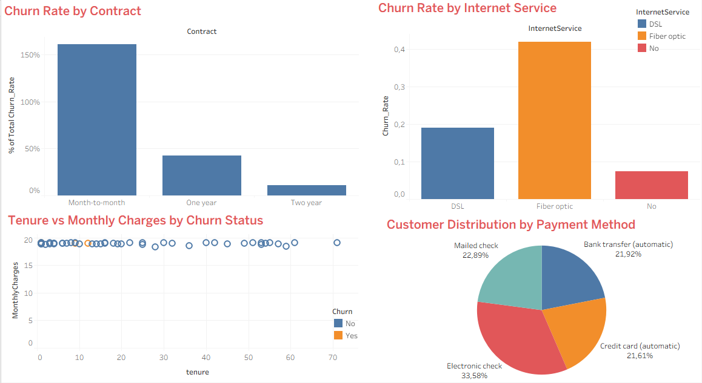

# Telco Customer Churn Analysis

SQL və Tableau istifadə edərək telekom müştərilərinin tərk etmə (churn) səbəblərinin analizi.

## Məqsəd

Bu layihə aşağıdakı sualı cavablandırır: **Hansı müştəri seqmenti daha çox tərk edir və niyə?**

## Verilənlər bazası

Kaggle-ın məşhur **Telco Customer Churn** dataseti (IBM) istifadə olunub:

- 7,043 müştəri, 21 sütun
- Müştəri profili (gender, SeniorCitizen, Partner, Dependents)
- Xidmət növləri (InternetService, OnlineSecurity, TechSupport, StreamingTV və s.)
- Müqavilə və ödəniş (Contract, PaymentMethod, MonthlyCharges, tenure)
- Hədəf dəyişən: **Churn** (Yes/No)

Mənbə: [Kaggle – Telco Customer Churn](https://www.kaggle.com/datasets/blastchar/telco-customer-churn)

## İstifadə olunan alətlər

- **SQL** – analitik sorğular (GROUP BY, CASE, faiz hesablamaları)
- **Tableau** – dashboard və vizuallaşdırma

## Metodologiya

1. Müqavilə tipi (Contract) üzrə churn dərəcəsi hesablanıb
2. Internet xidməti tipi üzrə churn dərəcəsi hesablanıb
3. Churn statusuna görə orta tenure (müştərilik müddəti) və aylıq ödəniş müqayisə olunub
4. Müqavilə və internet xidməti birlikdə seqmentləşdirilərək ən yüksək risk qrupu tapılıb
5. Ödəniş üsulu üzrə müştəri paylanması araşdırılıb
6. Nəticələr Tableau-da 4 qrafikli dashboard-da vizuallaşdırılıb

SQL sorğularının hamısı [`telco_churn_analysis.sql`](./telco_churn_analysis.sql) faylındadır.

## Dashboard

Dashboard-u interaktiv görmək üçün [`dashboard.twbx`](./dashboard_tableau.twbx) faylını endirib Tableau Desktop-da açın (Tableau Public pulsuz mövcuddur).

Dashboard 4 hissədən ibarətdir:
- **Churn Rate by Contract Type** – müqavilə tipi üzrə tərk etmə dərəcəsi
- **Tenure vs Monthly Charges by Churn Status** – müştərilik müddəti və aylıq ödənişin churn statusuna görə paylanması
- **Churn Rate by Internet Service** – internet xidməti tipi üzrə tərk etmə dərəcəsi
- **Customer Distribution by Payment Method** – müştərilərin ödəniş üsuluna görə paylanması

## Əsas nəticələr

**1. Müqavilə tipi ən böyük təsiredicidir.** Month-to-month müştərilərin **42.7%-i** tərk edir, halbuki 1 illik müqavilədə bu **11.3%**, 2 illik müqavilədə isə cəmi **2.8%**-dir. Uzunmüddətli müqavilə müştəri sədaqətini əhəmiyyətli dərəcədə artırır.

**2. Fiber Optic internet istifadəçiləri daha çox tərk edir (41.9%)**, DSL istifadəçilərinə (19%) nisbətən. Bu, ya xidmət keyfiyyəti, ya da qiymət həssaslığı ilə bağlı ola bilər.

**3. Tərk edən müştərilər ortalama daha az müddət qalıb (18 ay)**, qalan müştərilərə nisbətən (37.6 ay) – yəni ilk aylar müştəri saxlama baxımından kritikdir.

**4. Electronic check ilə ödəyən müştərilərin churn dərəcəsi (45.3%) digər ödəniş üsullarından (15-19%) 2-3 dəfə yüksəkdir.** Avtomatik ödəniş üsulları (bank transfer, credit card) müştəri sədaqətini artırır.

## Ümumi nəticə

Ən yüksək churn riski – **month-to-month müqaviləli, Fiber Optic internetli, Electronic check ilə ödəyən, yeni (az müddətli) müştərilər**dədir. Şirkət bu seqmentə diqqət yetirməli, uzunmüddətli müqavilə və avtomatik ödəniş üsullarına keçidi təşviq etməlidir ki, tərk etmə riski azalsın.

## Fayllar

| Fayl | Təsvir |
|---|---|
| `telco_churn_analysis.sql` | Bütün analitik SQL sorğuları |
| `dashboard.twbx` | İnteraktiv Tableau dashboard faylı |
| `dashboard.png` | Dashboard-un şəkli |
